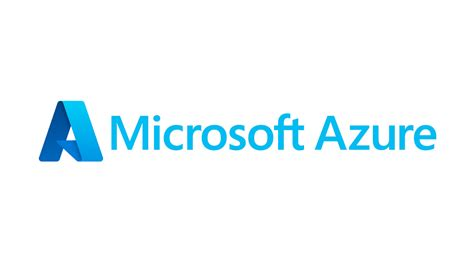
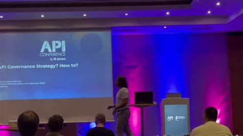
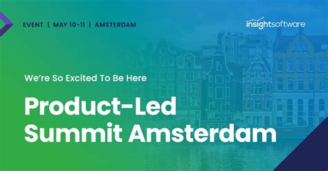
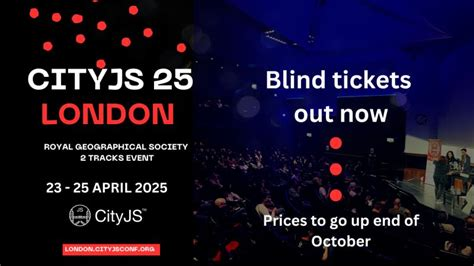
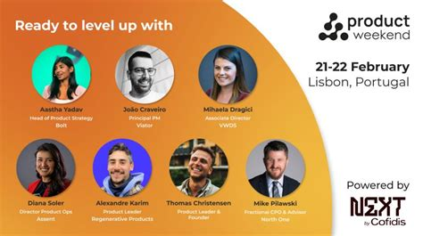
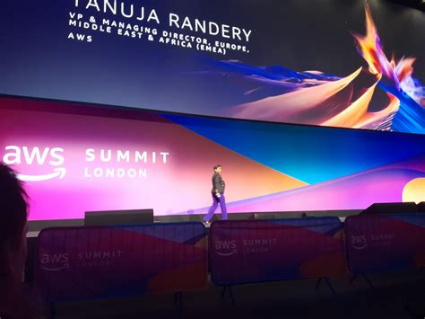

# Developer conferences - April-May 2026
 

## Azure AI Frontier Day - Munich

 
 

 
 

**Conference website**
[Azure - Ai frontier day](https://msevents.microsoft.com/event?id=237206394)

**Presentation**

The program features inspirational keynotes, hands-on technical sessions, and practical customer stories showing what’s possible with Azure today.

Drawing from real-world implementations, partners and customers will share how they are leveraging Azure to build intelligent applications, integrate AI into their operations, and accelerate time-to-value generation. Microsoft experts will guide you through best practices, architectural patterns, and actionable lessons for your team. 

**Dates** 20 May 2026

**Key speakers**
10+ speakers

Robert Eichenseer
Marcen Meier
Seamus Flynn
Melanie Sigl
Wesley Velasquez

And many more ...

**Event breakdown**
- 9:45 - 10:30 The Ai Frontier: Agents as the new workflow engine
- 10:45 - 11:30 AI in Action: Leveraging Microsoft Copilot, Azure 	 Document Intelligence and Azure OpenAI
- 11:30 - 12:15 AI in Action: Architecting Agentic AI with Microsoft Redefining Roles and Workflows in 2026
- 12:15 - 12:45 Fireside Chat: Starting Small, Delivering Fast - A Real Data and AI Project Journey
- 13:45 - 14:45 Making AI Business-Aware: Fabric IQ as the Semantic Brain of Microsoft Fabric
- 14:45 - 15:45 How AI Agents Find the Right Answer: A deep Dive into Foundry IQ
- 16:15 - 17:45 Closing Keynote - AI Won't Fix Your Engineering Culture 

 
 

## API Conference - London

 
 

 
 

**Conference website**
[API conference - London](https://apiconference.net/london/)

**Presentation**
The conferences features all aspects of API development Devops, Governance, Design, Development, AI and data integration and security

**Dates** 11-15 May 2026

**Key speakers**
- Matthias Biehl
- Tobias Polley
- Viola Marku

 

**Event highlights**

12 and 13 May 2026
- Enterprise APIs and MCP: The Missing Link to AI Innovation - Matthias Biehl from API-University
- Humanising API access with AI: a journey in turning distributed systems into an insight layer - Viola Marku from WunderGraph

11 and 14 May 2026
- Intentional API Design Workshop - Matthias Biehl from API-University
- Workshop: Master API Security: Hands-on Protection with OAuth2, OpenID Connect and Token Exchange - Tobias Polley, predic8

 
 

## Product-led Summit - Amsterdam

 
 

 
 

**Conference website**
[Product-Led Summit - Amsterdam](https://world.productledalliance.com/location/amsterdam)

**Presentation**
Connect with product leaders who've already tackled and solved key challenges in their sectors and learn the frameworks that work and exclude the ones that don't, topics such activation, conversion and expansion.

**Dates**
28-29 May 2026

**Key speakers**

25+ speakers

- Andreea Cuibar, Global Product Manager from Coca-Cola HBC
- Omar Sallam, Senor Product Leader  from Booking.com
- Ezgi Göçücü, Senior Product Director from Sitecore
- Andrew Shaw, Director of Product from OLX
- Angad Abrol, Vice President of Product from FarEye
- Nikhil Kattan, Director of Products from TomTom

and many more ...

**Event highlights**

- Self-serve vs sales-assist balance
- Build AI features people actually pay for
- Align Product, Sales and Marketing
- Diagnose your activation bottlenecks
- Experiments that move conversion 3-5%
- Predictable growth and retention loops
  
 
 

## CityJS London 2026

 
 

 
 

**Conference website**
[CityJS](https://london.cityjsconf.org/?utm_source=cityjs_homecard&utm_medium=button&utm_campaign=learn_more)

**Presentation**
This event in central London presents all the latest innovations on the web from the AI bubble to vibe coding and new tooling changes.

**Dates**
15-17 April 2026

**Key speakers**
35+ speakers

- David Whitney from NewDay - The future of the AI bubble
- Robin Ginn from OpenJS Foundation- Silicon Valley is Optional. Github is not
- Kitze from Sizzy - From Vibe Coding to Vibe Engineering
- Sara Vieira (Senior Frontend Developer) - Main stage MC
- Tejas Kumar from IBM - The New UX

And many more ...

**Event breakdown**

- First day mixes free meetups, speakers and workshops
- Second day is split between professional and free workshops
- Third day is a full conference day

 
 

## Product Weekend Builders - Lisbon

 
 

 
 

**Conference website**
[Product Weekend - Builders](https://www.productcircle.co/lisbon-apr2026)

**Presentation**
Product Circle presents their workshop tailored for product managers facing the challenges of today's market and their role. Topics include:

- The Future of Product Management
- AI and Automation, Applied
- Product Decisions with Business Impact
- Real Feedback on Real Challenges 

**Dates** Single date - 11 April 2026

**Key speakers**
- Joao Moita - Intro and get to know
- Panel discussion: Your future in product management - Begona Sesè de Lucio
- Katja Hunstock - Modern Product Thinking
- Joao Moita - AI workflows for Product Managers
- Rich Mironow - Speaking the language of money with executives
- Joao Moita - Mastermind Session with Everyone

 

**Event breakdown**
- 9:30 Intro and get to know
- 10:00 Panel discussion: Your future in product management
- 11:30 Modern product thinking
- 13:30 AI and automations for product people
- 15:00 From features to business impact
- 16:30 Mastermind session
- 18:00 Closing session

 
 

## Aws Summit London

 
 

 
 

**Conference website**
[Aws Summit London](https://aws.amazon.com/events/summits/london/)

**Presentation**
AWS Summit London is your gateway to the future of cloud and AI innovation. This one-day event brings together the technologies.

**Dates** 22 April 2026

**Key speakers**
- Francessca Vasquez
- Alison Kay
- Dr. Werner Vogels
- Greg Jackson CBE
- Ryan Cormack

<brs>

**Event highlights**
- 200+ presentations across agentic AI, data, security and cloud innovation
- AWS Sports Zone - Explore how AWS enhances sports through sports analytics and fan experiences in their interactive zone
- Industry Zone - Explore how AWS in shaping industries with demos and expert panels tackling key sector challenges
- Urban Nature Hub - Sustainability demos including a partnership with the Natural History Museum
- Startup Loft - Connect with AWS experts and startup  sector colleagues and access resources to fast-track your startup's growth
- One Amazon Lane - Explore fully integrated Amazon Homes, an Amazon solution offering fully furnished houses enhanced also with real world AI application

 
 

 
 
